# AIO Upgrade Plugin for Camunda Modeler

  

> Cover is a real animated-SVG export. GitHub shows it static — open
> [samples/diagram-animated.svg](samples/diagram-animated.svg) in a browser to
> watch the flows animate.

An all-in-one set of editing upgrades for the Camunda Modeler (5.x): resizable
BPMN elements plus a handful of related conveniences.

Out of the box the Camunda Modeler only lets you resize pools and expanded
sub-processes. This plugin extends resizing to most other shapes and throws in
keyboard resizing, fit-to-label, an aspect-ratio lock, an animated flow line,
control over the collapsed sub-process marker, horizontal/vertical flipping of
a selection, background boxes, and animated SVG / GIF export.

## What it does

Resizing

- Tasks (every task type), sub-processes, transactions, ad-hoc sub-processes,
  call activities, data objects, data stores, groups, text annotations and
  participants can be resized by dragging their handles.
- Events and gateways are deliberately left at their fixed BPMN sizes so
  diagrams stay portable across tools.
- Each element type has a minimum size, so a shape can't be collapsed to
  nothing by accident.

Editing helpers

- Fit to label: select a shape and use the "Fit to label" button in the context
  pad to grow it until the whole label fits.
- Reset size: the "Reset to default size" button in the context pad puts a shape
  back to its standard dimensions.
- Keyboard resize: with a shape selected, Ctrl+Shift+Arrow grows it; hold Alt as
  well to shrink.
- Aspect-ratio lock: hold Shift while dragging a resize handle to keep the
  original width-to-height ratio.

Connections

- Flows are drawn solid with a filled arrowhead by default (message flows too,
  which BPMN normally dashes with a hollow arrow); the dashed look is reserved
  for the flow animation below.
- Flow animation: select a sequence or message flow and use the "Toggle flow
  animation" button in its context pad to run an animated dashed line along it.
  Each connection animates independently. It is a viewing aid only. You can
  also toggle it on the selected flow(s) with Ctrl+Shift+L.
- Two-way line: select a flow and use the "Toggle two-way line" button in its
  context pad to draw the line solid with a filled arrowhead on both ends. When
  a two-way line is also animated, a circle slides back and forth along it (the
  one-way marching-dash animation is replaced by the moving circle). Visual only.

Collapsed sub-process marker

- Select a collapsed sub-process and use its context-pad buttons to hide or show
  the "+" marker and to cycle its position between bottom-center and the four
  corners. Each sub-process keeps its own setting. The hide/position choice now
  persists with the file and is restored when you reopen the diagram.

Flip a selection

- Select two or more shapes; the align button appears (the same one used for
  aligning elements). Open it and use the "Flip" group to mirror the selection
  horizontally or vertically. Connections between the shapes re-route
  automatically.

Background box

- Use the "BG" tool in the left palette to drop a background box, then drag its
  handles to size it anywhere with no minimum. It draws as a clean filled
  rectangle and always stays behind everything else, so you can shade or group
  regions of a diagram. Recolour the fill and border with Camunda Modeler's
  colour picker. It is a real, saved element (a bpmn:Group), undoable with
  Ctrl+Z.

Export (SVG / GIF)

- The "SVG" palette button exports the diagram as a self-contained animated SVG,
  so it keeps playing when opened in a web browser or an image preview (the
  motion uses CSS, not SMIL, so it runs wherever CSS animations do). The cover
  image at the top of this README is one such export.
- The "GIF" palette button captures the animation and saves a looping GIF
  (~4.4s, 12 fps, scaled to <=1000px). Handy where an animated SVG won't play —
  Reddit, chat apps, slide decks.

Resizing and flipping go through the modeler's command stack, so they can be
undone with Ctrl+Z (a flip currently undoes one shape at a time). The flow
animation, two-way state, collapsed-marker setting and background boxes are saved
with the diagram; the SVG/GIF exports are one-off downloads and never change it.

## Building

    npm install
    npm test
    npm run bundle

`npm test` runs the unit tests for the plugin's pure logic with Node's built-in
test runner. `npm run bundle` builds `client/client-bundle.js` with webpack.

## Installing

On Windows:

    npm run deploy

That copies the plugin into `%APPDATA%\camunda-modeler\plugins`. On macOS or
Linux, copy the plugin folder (the one containing `index.js`) into the Camunda
Modeler plugins directory by hand. Restart the Modeler afterwards, since plugins
are only loaded at startup.

## License

MIT
